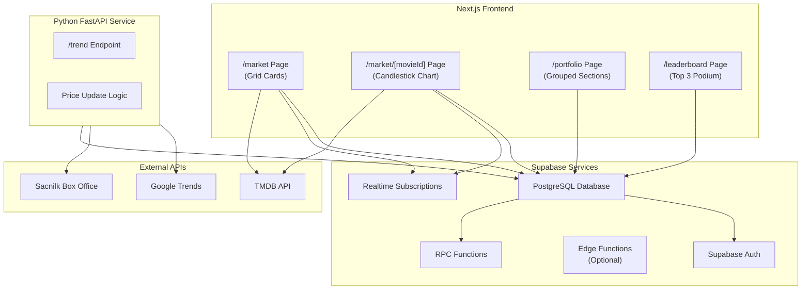

# Movie Stock Trading System - Implementation Plan

## Architecture Overview




## Phase 0: Firebase to Supabase Migration (Existing Features)

### 0.1 Migration Strategy

Migrate existing Firebase features (watchlist, reviews, watched history) to Supabase while keeping Firebase Auth for backward compatibility during transition.**Migration Steps:**

1. **Create Supabase tables for existing features:**

- `watchlists` table (migrate from Firestore)
- `reviews` table (migrate from Firestore)
- `watched_history` table (migrate from Firestore)
- Link to existing `profiles` table or create if needed

2. **Create migration scripts:**

- `scripts/migrate-watchlist-to-supabase.ts` - Migrate watchlist data
- `scripts/migrate-reviews-to-supabase.ts` - Migrate reviews data
- `scripts/migrate-watched-to-supabase.ts` - Migrate watched history

3. **Update API routes:**

- Update `app/api/watchlist/**` to use Supabase
- Update `app/api/reviews/**` to use Supabase
- Update `app/api/watched/**` to use Supabase

4. **Update client-side code:**

- Replace Firestore calls with Supabase calls
- Update hooks and components
- Maintain backward compatibility during migration

5. **Data validation:**

- Verify all data migrated correctly
- Test all existing features
- Handle edge cases and missing data

**Files to create/modify:**

- `scripts/migrate-watchlist-to-supabase.ts`
- `scripts/migrate-reviews-to-supabase.ts`
- `scripts/migrate-watched-to-supabase.ts`
- `lib/supabase/migration-helpers.ts` - Shared migration utilities
- Update all watchlist/reviews/watched API routes
- Update client components using Firestore

### 0.2 Supabase Tables for Existing Features

```sql
-- Watchlists table (if not exists from feature-spec.md)
CREATE TABLE IF NOT EXISTS public.watchlists (
  id UUID DEFAULT gen_random_uuid() PRIMARY KEY,
  user_id UUID REFERENCES auth.users(id) ON DELETE CASCADE NOT NULL,
  movie_id TEXT NOT NULL, -- TMDB ID
  created_at TIMESTAMPTZ DEFAULT NOW(),
  UNIQUE(user_id, movie_id)
);

-- Reviews/Watched History table (if not exists)
CREATE TABLE IF NOT EXISTS public.reviews (
  id UUID DEFAULT gen_random_uuid() PRIMARY KEY,
  user_id UUID REFERENCES auth.users(id) ON DELETE CASCADE NOT NULL,
  movie_id TEXT NOT NULL, -- TMDB ID
  rating INTEGER CHECK (rating >= 1 AND rating <= 10),
  body TEXT,
  watched_at TIMESTAMPTZ DEFAULT NOW(),
  likes_count INTEGER DEFAULT 0,
  created_at TIMESTAMPTZ DEFAULT NOW(),
  updated_at TIMESTAMPTZ DEFAULT NOW(),
  UNIQUE(user_id, movie_id)
);

-- Indexes
CREATE INDEX IF NOT EXISTS idx_watchlists_user_id ON public.watchlists(user_id);
CREATE INDEX IF NOT EXISTS idx_reviews_user_id ON public.reviews(user_id);
CREATE INDEX IF NOT EXISTS idx_reviews_movie_id ON public.reviews(movie_id);
```


## Phase 1: Supabase Setup & Database Schema

### 1.1 Supabase Project Setup

1. Create Supabase project (if not exists)
2. Get project URL and anon key
3. Set up environment variables:

- `NEXT_PUBLIC_SUPABASE_URL`
- `NEXT_PUBLIC_SUPABASE_ANON_KEY`
- `SUPABASE_SERVICE_ROLE_KEY` (server-only)

### 1.2 Supabase Client Setup

Create `lib/supabase/client.ts`:

```typescript
import { createClient } from '@supabase/supabase-js'

const supabaseUrl = process.env.NEXT_PUBLIC_SUPABASE_URL!
const supabaseAnonKey = process.env.NEXT_PUBLIC_SUPABASE_ANON_KEY!

export const supabase = createClient(supabaseUrl, supabaseAnonKey)
```

Create `lib/supabase/server.ts`:

```typescript
import { createClient } from '@supabase/supabase-js'
import { cookies } from 'next/headers'

export const createServerClient = () => {
  const cookieStore = cookies()
  return createClient(
    process.env.NEXT_PUBLIC_SUPABASE_URL!,
    process.env.NEXT_PUBLIC_SUPABASE_ANON_KEY!,
    {
      cookies: {
        get(name: string) {
          return cookieStore.get(name)?.value
        },
      },
    }
  )
}
```


### 1.3 Database Schema (PostgreSQL)

Run this SQL in Supabase SQL Editor:

```sql
-- Enable necessary extensions
CREATE EXTENSION IF NOT EXISTS "uuid-ossp";

-- Create enum for stock status
CREATE TYPE stock_status AS ENUM ('UPCOMING', 'ACTIVE', 'DELISTED');

-- 1. Market Users Table (extends profiles)
-- Note: If profiles table exists from feature-spec.md, add columns instead
CREATE TABLE IF NOT EXISTS public.market_users (
  id UUID REFERENCES auth.users(id) ON DELETE CASCADE PRIMARY KEY,
  username TEXT,
  avatar_url TEXT,
  coins NUMERIC DEFAULT 20000 NOT NULL,
  net_worth NUMERIC DEFAULT 20000 NOT NULL,
  created_at TIMESTAMPTZ DEFAULT NOW(),
  updated_at TIMESTAMPTZ DEFAULT NOW()
);

-- 2. Movie Stocks Table
CREATE TABLE IF NOT EXISTS public.movie_stocks (
  id TEXT PRIMARY KEY, -- TMDB ID as string
  tmdb_id INTEGER UNIQUE NOT NULL,
  title TEXT NOT NULL,
  poster_path TEXT,
  release_date DATE,
  status stock_status DEFAULT 'UPCOMING',
  current_price NUMERIC DEFAULT 100 NOT NULL,
  price_change_24h NUMERIC DEFAULT 0,
  hype_index NUMERIC DEFAULT 0, -- 0-100
  box_office_index NUMERIC DEFAULT 0, -- 0-100
  wom_index NUMERIC DEFAULT 0, -- 0-100 (word of mouth)
  last_updated TIMESTAMPTZ DEFAULT NOW(),
  created_at TIMESTAMPTZ DEFAULT NOW()
);

-- 3. Portfolios Table
CREATE TABLE IF NOT EXISTS public.portfolios (
  id UUID DEFAULT gen_random_uuid() PRIMARY KEY,
  user_id UUID REFERENCES public.market_users(id) ON DELETE CASCADE NOT NULL,
  movie_id TEXT REFERENCES public.movie_stocks(id) ON DELETE CASCADE NOT NULL,
  quantity INTEGER DEFAULT 0 NOT NULL,
  avg_buy_price NUMERIC DEFAULT 0 NOT NULL,
  created_at TIMESTAMPTZ DEFAULT NOW(),
  updated_at TIMESTAMPTZ DEFAULT NOW(),
  UNIQUE(user_id, movie_id)
);

-- 4. Market History Table (for charts)
CREATE TABLE IF NOT EXISTS public.market_history (
  id BIGSERIAL PRIMARY KEY,
  movie_id TEXT REFERENCES public.movie_stocks(id) ON DELETE CASCADE NOT NULL,
  price NUMERIC NOT NULL,
  recorded_at TIMESTAMPTZ DEFAULT NOW()
);

-- 5. Transactions Table
CREATE TABLE IF NOT EXISTS public.transactions (
  id UUID DEFAULT gen_random_uuid() PRIMARY KEY,
  user_id UUID REFERENCES public.market_users(id) ON DELETE CASCADE NOT NULL,
  movie_id TEXT REFERENCES public.movie_stocks(id) ON DELETE CASCADE NOT NULL,
  type TEXT NOT NULL CHECK (type IN ('BUY', 'SELL')),
  price NUMERIC NOT NULL,
  quantity INTEGER NOT NULL,
  total_cost NUMERIC NOT NULL,
  timestamp TIMESTAMPTZ DEFAULT NOW()
);

-- Create indexes for performance
CREATE INDEX IF NOT EXISTS idx_portfolios_user_id ON public.portfolios(user_id);
CREATE INDEX IF NOT EXISTS idx_portfolios_movie_id ON public.portfolios(movie_id);
CREATE INDEX IF NOT EXISTS idx_market_history_movie_id ON public.market_history(movie_id);
CREATE INDEX IF NOT EXISTS idx_market_history_recorded_at ON public.market_history(recorded_at DESC);
CREATE INDEX IF NOT EXISTS idx_transactions_user_id ON public.transactions(user_id);
CREATE INDEX IF NOT EXISTS idx_transactions_movie_id ON public.transactions(movie_id);
CREATE INDEX IF NOT EXISTS idx_movie_stocks_status ON public.movie_stocks(status);
CREATE INDEX IF NOT EXISTS idx_market_users_net_worth ON public.market_users(net_worth DESC);

-- Create function to update updated_at timestamp
CREATE OR REPLACE FUNCTION update_updated_at_column()
RETURNS TRIGGER AS $$
BEGIN
    NEW.updated_at = NOW();
    RETURN NEW;
END;
$$ language 'plpgsql';

-- Add triggers for updated_at
CREATE TRIGGER update_market_users_updated_at BEFORE UPDATE ON public.market_users
    FOR EACH ROW EXECUTE FUNCTION update_updated_at_column();

CREATE TRIGGER update_portfolios_updated_at BEFORE UPDATE ON public.portfolios
    FOR EACH ROW EXECUTE FUNCTION update_updated_at_column();
```


### 1.4 Row Level Security (RLS) Policies

```sql
-- Enable RLS on all tables
ALTER TABLE public.market_users ENABLE ROW LEVEL SECURITY;
ALTER TABLE public.movie_stocks ENABLE ROW LEVEL SECURITY;
ALTER TABLE public.portfolios ENABLE ROW LEVEL SECURITY;
ALTER TABLE public.market_history ENABLE ROW LEVEL SECURITY;
ALTER TABLE public.transactions ENABLE ROW LEVEL SECURITY;

-- Market Users: Read all, update own
CREATE POLICY "market_users_select_all" ON public.market_users
    FOR SELECT USING (true);

CREATE POLICY "market_users_update_own" ON public.market_users
    FOR UPDATE USING (auth.uid() = id);

-- Movie Stocks: Read all, write only via service role
CREATE POLICY "movie_stocks_select_all" ON public.movie_stocks
    FOR SELECT USING (true);

-- Portfolios: Read own, write own
CREATE POLICY "portfolios_select_own" ON public.portfolios
    FOR SELECT USING (auth.uid() = user_id);

CREATE POLICY "portfolios_insert_own" ON public.portfolios
    FOR INSERT WITH CHECK (auth.uid() = user_id);

CREATE POLICY "portfolios_update_own" ON public.portfolios
    FOR UPDATE USING (auth.uid() = user_id);

CREATE POLICY "portfolios_delete_own" ON public.portfolios
    FOR DELETE USING (auth.uid() = user_id);

-- Market History: Read all, write only via service role
CREATE POLICY "market_history_select_all" ON public.market_history
    FOR SELECT USING (true);

-- Transactions: Read own, insert own
CREATE POLICY "transactions_select_own" ON public.transactions
    FOR SELECT USING (auth.uid() = user_id);

CREATE POLICY "transactions_insert_own" ON public.transactions
    FOR INSERT WITH CHECK (auth.uid() = user_id);
```


### 1.5 RPC Functions for Transactions

Create secure database functions for buy/sell operations:

```sql
-- Buy Stock Function
CREATE OR REPLACE FUNCTION buy_stock(
  target_movie_id TEXT,
  qty INTEGER
)
RETURNS JSON AS $$
DECLARE
  user_balance NUMERIC;
  stock_price NUMERIC;
  total_cost NUMERIC;
  current_qty INTEGER;
  new_avg_price NUMERIC;
  stock_status stock_status;
BEGIN
  -- 1. Get current stock price and status
  SELECT current_price, status INTO stock_price, stock_status 
  FROM movie_stocks WHERE id = target_movie_id;
  
  IF NOT FOUND THEN
    RETURN json_build_object('success', false, 'message', 'Stock not found');
  END IF;
  
  IF stock_status != 'ACTIVE' THEN
    RETURN json_build_object('success', false, 'message', 'Stock is not active for trading');
  END IF;
  
  -- 2. Get user's coin balance
  SELECT coins INTO user_balance 
  FROM market_users WHERE id = auth.uid();
  
  IF NOT FOUND THEN
    RETURN json_build_object('success', false, 'message', 'User not found');
  END IF;
  
  -- 3. Calculate Cost
  total_cost := stock_price * qty;

  -- 4. VALIDATION: Can they afford it?
  IF user_balance < total_cost THEN
    RETURN json_build_object('success', false, 'message', 'Insufficient funds');
  END IF;

  -- 5. EXECUTE: Deduct Coins
  UPDATE market_users 
  SET coins = coins - total_cost 
  WHERE id = auth.uid();

  -- 6. EXECUTE: Update Portfolio
  SELECT quantity INTO current_qty 
  FROM portfolios 
  WHERE user_id = auth.uid() AND movie_id = target_movie_id;

  IF FOUND THEN
    -- Update existing holding (Weighted Average Price)
    new_avg_price := ((current_qty * avg_buy_price) + (qty * stock_price)) / (current_qty + qty);
    UPDATE portfolios 
    SET quantity = quantity + qty,
        avg_buy_price = new_avg_price,
        updated_at = NOW()
    WHERE user_id = auth.uid() AND movie_id = target_movie_id;
  ELSE
    -- New purchase
    INSERT INTO portfolios (user_id, movie_id, quantity, avg_buy_price)
    VALUES (auth.uid(), target_movie_id, qty, stock_price);
  END IF;

  -- 7. Log Transaction
  INSERT INTO transactions (user_id, movie_id, type, price, quantity, total_cost)
  VALUES (auth.uid(), target_movie_id, 'BUY', stock_price, qty, total_cost);

  -- 8. Update net worth (trigger or function call)
  PERFORM update_user_net_worth(auth.uid());

  RETURN json_build_object(
    'success', true, 
    'new_balance', user_balance - total_cost,
    'total_cost', total_cost
  );
END;
$$ LANGUAGE plpgsql SECURITY DEFINER;

-- Sell Stock Function
CREATE OR REPLACE FUNCTION sell_stock(
  target_movie_id TEXT,
  qty INTEGER
)
RETURNS JSON AS $$
DECLARE
  user_balance NUMERIC;
  stock_price NUMERIC;
  total_proceeds NUMERIC;
  current_qty INTEGER;
  current_avg_price NUMERIC;
BEGIN
  -- 1. Get current stock price
  SELECT current_price INTO stock_price 
  FROM movie_stocks WHERE id = target_movie_id;
  
  IF NOT FOUND THEN
    RETURN json_build_object('success', false, 'message', 'Stock not found');
  END IF;
  
  -- 2. Check portfolio quantity
  SELECT quantity, avg_buy_price INTO current_qty, current_avg_price
  FROM portfolios 
  WHERE user_id = auth.uid() AND movie_id = target_movie_id;
  
  IF NOT FOUND OR current_qty < qty THEN
    RETURN json_build_object('success', false, 'message', 'Insufficient shares');
  END IF;
  
  -- 3. Calculate Proceeds
  total_proceeds := stock_price * qty;

  -- 4. EXECUTE: Add Coins
  UPDATE market_users 
  SET coins = coins + total_proceeds 
  WHERE id = auth.uid();

  -- 5. EXECUTE: Update Portfolio
  IF current_qty = qty THEN
    -- Delete if selling all
    DELETE FROM portfolios 
    WHERE user_id = auth.uid() AND movie_id = target_movie_id;
  ELSE
    -- Reduce quantity
    UPDATE portfolios 
    SET quantity = quantity - qty,
        updated_at = NOW()
    WHERE user_id = auth.uid() AND movie_id = target_movie_id;
  END IF;

  -- 6. Log Transaction
  INSERT INTO transactions (user_id, movie_id, type, price, quantity, total_cost)
  VALUES (auth.uid(), target_movie_id, 'SELL', stock_price, qty, total_proceeds);

  -- 7. Update net worth
  PERFORM update_user_net_worth(auth.uid());

  RETURN json_build_object(
    'success', true, 
    'new_balance', (SELECT coins FROM market_users WHERE id = auth.uid())::NUMERIC,
    'total_proceeds', total_proceeds,
    'profit_loss', (stock_price - current_avg_price) * qty
  );
END;
$$ LANGUAGE plpgsql SECURITY DEFINER;

-- Net Worth Calculation Function
CREATE OR REPLACE FUNCTION update_user_net_worth(target_user_id UUID)
RETURNS NUMERIC AS $$
DECLARE
  user_coins NUMERIC;
  portfolio_value NUMERIC;
  calculated_net_worth NUMERIC;
BEGIN
  -- Get user's coins
  SELECT coins INTO user_coins FROM market_users WHERE id = target_user_id;
  
  -- Calculate portfolio value
  SELECT COALESCE(SUM(p.quantity * ms.current_price), 0) INTO portfolio_value
  FROM portfolios p
  JOIN movie_stocks ms ON p.movie_id = ms.id
  WHERE p.user_id = target_user_id;
  
  -- Calculate net worth
  calculated_net_worth := user_coins + portfolio_value;
  
  -- Update user's net worth
  UPDATE market_users 
  SET net_worth = calculated_net_worth
  WHERE id = target_user_id;
  
  RETURN calculated_net_worth;
END;
$$ LANGUAGE plpgsql SECURITY DEFINER;
```


### 1.6 User Initialization Trigger

```sql
-- Auto-create market_user when auth user is created
CREATE OR REPLACE FUNCTION handle_new_market_user()
RETURNS TRIGGER AS $$
BEGIN
  INSERT INTO public.market_users (id, username, avatar_url, coins, net_worth)
  VALUES (
    NEW.id,
    COALESCE(NEW.raw_user_meta_data->>'username', NEW.email, 'Anonymous'),
    NEW.raw_user_meta_data->>'avatar_url',
    20000,
    20000
  );
  RETURN NEW;
END;
$$ LANGUAGE plpgsql SECURITY DEFINER;

DROP TRIGGER IF EXISTS on_auth_user_created_market ON auth.users;
CREATE TRIGGER on_auth_user_created_market
  AFTER INSERT ON auth.users
  FOR EACH ROW EXECUTE FUNCTION handle_new_market_user();
```

**Files to create:**

- `lib/supabase/client.ts` - Client-side Supabase client
- `lib/supabase/server.ts` - Server-side Supabase client
- `lib/market/types.ts` - TypeScript interfaces for all market entities

## Phase 2: Transaction Engine (RPC Functions & API Routes)

### 2.1 Buy Stock API Route

Create `app/api/market/buy/route.ts`:

- Authenticate user (get Supabase session)
- Call `buy_stock` RPC function
- Return success/error response
- Handle validation errors

**Key Features:**

- Always show confirmation dialog before executing
- Toast notification with coin animation on success
- Error handling with user-friendly messages

### 2.2 Sell Stock API Route

Create `app/api/market/sell/route.ts`:

- Authenticate user
- Call `sell_stock` RPC function
- Return success/error with profit/loss info
- Handle validation errors

**Key Features:**

- Always show confirmation dialog
- Show profit/loss in response
- Toast notification with animation

### 2.3 Portfolio Utilities

Create `lib/market/portfolio-utils.ts`:

- Function to fetch user portfolio
- Function to calculate portfolio value
- Helper to format profit/loss display

**Files to create:**

- `app/api/market/buy/route.ts`
- `app/api/market/sell/route.ts`
- `lib/market/portfolio-utils.ts`
- `lib/market/api-helpers.ts` - Shared API utilities

## Phase 3: Python Price Update Service

### 3.1 FastAPI Service Setup

Create Python service structure:

```javascript
python-service/
├── main.py
├── price_engine.py
├── supabase_client.py
├── requirements.txt
├── .env.example
└── README.md
```

**main.py** endpoints:

- `GET /trend?keyword={movie_title}` - Get Google Trends score (0-100)
- `GET /box-office?movie_title={title}` - Get Sacnilk box office data
- `POST /update-prices` - Batch update prices (called by cron)
- `GET /health` - Health check

**Dependencies:**

- `fastapi`
- `pytrends` (Google Trends)
- `supabase` (Python client)
- `requests` (for Sacnilk scraping)
- `python-dotenv`

### 3.2 Supabase Client Setup

Create `python-service/supabase_client.py`:

```python
from supabase import create_client, Client
import os

def get_supabase_client() -> Client:
    url = os.getenv("SUPABASE_URL")
    key = os.getenv("SUPABASE_SERVICE_ROLE_KEY")
    return create_client(url, key)
```


### 3.3 Price Calculation Algorithm

Price update logic in `python-service/price_engine.py`:

```python
def calculate_new_price(old_price, hype_index, box_office_index, wom_index):
    # Weighted formula
    trend_score = (hype_index * 0.4) + (box_office_index * 0.4) + (wom_index * 0.2)
    
    # Dampened update to prevent wild swings
    new_price = (old_price * 0.8) + (trend_score * 0.5)
    
    # Clamp to reasonable range (10-1000)
    return max(10, min(1000, new_price))

def calculate_price_change_24h(new_price, old_price):
    if old_price == 0:
        return 0
    return ((new_price - old_price) / old_price) * 100
```


### 3.4 Price Update Endpoint

```python
@app.post("/update-prices")
async def update_prices():
    supabase = get_supabase_client()
    
    # Get all ACTIVE stocks
    stocks = supabase.table("movie_stocks").select("*").eq("status", "ACTIVE").execute()
    
    for stock in stocks.data:
        # Fetch trend data
        trend_data = await get_trend_score(stock["title"])
        box_office_data = await get_box_office_score(stock["title"])
        wom_data = calculate_wom_index(stock["id"])  # From reviews
        
        # Calculate new price
        old_price = stock["current_price"]
        new_price = calculate_new_price(
            old_price,
            trend_data["score"],
            box_office_data["score"],
            wom_data
        )
        
        price_change_24h = calculate_price_change_24h(new_price, old_price)
        
        # Update database
        supabase.table("movie_stocks").update({
            "current_price": new_price,
            "price_change_24h": price_change_24h,
            "hype_index": trend_data["score"],
            "box_office_index": box_office_data["score"],
            "wom_index": wom_data,
            "last_updated": "now()"
        }).eq("id", stock["id"]).execute()
        
        # Save history point
        supabase.table("market_history").insert({
            "movie_id": stock["id"],
            "price": new_price
        }).execute()
    
    return {"status": "success", "updated": len(stocks.data)}
```


### 3.5 Deployment

Deploy to Render.com (free tier):

- Set environment variables:
- `SUPABASE_URL`
- `SUPABASE_SERVICE_ROLE_KEY`
- `GOOGLE_TRENDS_API_KEY` (if needed)
- Configure health check endpoint
- Set up external cron job (cron-job.org) to call `/update-prices` every hour

**Files to create:**

- `python-service/main.py`
- `python-service/price_engine.py`
- `python-service/supabase_client.py`
- `python-service/requirements.txt`
- `python-service/.env.example`

## Phase 4: Frontend - Market Pages (UI/UX Implementation)

### 4.1 Market List Page (`/market`)

Create `app/market/page.tsx`:

- Server component for initial data (SEO)
- Client component wrapper for interactivity

**UI Features:**

- **Layout**: Grid of cards (2-3 columns on mobile, responsive)
- **Price Display**: Large, bold price as primary element on each card
- Uses `--primary` color for price text
- **Status Badge**: Badge showing Active/Upcoming/Delisted
- Uses `--primary` for active, `--secondary` for upcoming
- **Search & Filters**: Full search + filters + sort
- Search by movie title
- Filter by status (Active/Upcoming)
- Sort by: price (asc/desc), change (asc/desc), name (A-Z)
- **Loading States**: Skeleton loaders for grid
- **Empty States**: Illustration + CTA button + helpful tips
- **Pull to Refresh**: Swipe down to refresh prices
- **Swipe Actions**: Swipe left/right for quick buy/sell (optional)
- **Color Scheme**: 
- Strictly use `--primary` and `--secondary` from globals.css
- Light/dark theme support only (no custom themes)
- Use `--destructive` for negative changes (red)

**Card Components:**

- `components/market/StockCard.tsx` - Main stock card
- Movie poster (AspectRatio)
- Title
- Large bold price (using `--primary` color)
- 24h change indicator (color-coded with `--primary`/`--destructive`, arrow)
- Status badge (using `--primary`/`--secondary`)
- Quick action buttons (Buy/Sell using `--primary` color)

### 4.2 Individual Stock Page (`/market/[movieId]`)

Create `app/market/[movieId]/page.tsx`:

- Server component for initial data
- Client component for real-time updates

**Sections:**

1. **Stock Info Card**

- Large price display with real-time ticker
- 24h change (color flash animation on update)
- Status badge
- Indices display (Hype, Box Office, WOM)

2. **Price Chart**

- **Chart Type Toggle**: Switch between Candlestick and Line chart
    - Toggle button in chart header
    - User preference saved
- **Candlestick Chart**: Using lightweight-charts
- **Line Chart**: Using recharts (default)
- **Timeframes**: 1H, 24H, 7D, 30D, All Time tabs
- **Sparkline**: Mini sparkline in header
- **Colors**: Uses `--primary` for chart line/candles, `--secondary` for background
- Responsive, mobile-optimized

3. **Trading Interface**

- Buy/Sell buttons
- Opens bottom sheet on click
- Shows user's current holdings (if any)

4. **User Holdings Section** (if user owns stock)

- Quantity owned
- Avg buy price
- Current value
- Profit/Loss (all indicators: color, badge, percentage, absolute)

5. **Recent Transactions** (user's own)

**Components:**

- `components/market/PriceChart.tsx` - Chart with type toggle (candlestick/line) and timeframe selector
- `components/market/StockInfoCard.tsx` - Stock information display (uses `--primary`/`--secondary`)
- `components/market/PriceTicker.tsx` - Real-time price with color flash animation (uses `--primary`/`--destructive`)

### 4.3 Portfolio Page (`/portfolio`)

Create `app/portfolio/page.tsx`:

- Client component (requires auth)

**UI Features:**

- **Layout**: Grouped sections (Gainers, Losers, Neutral)
- **Summary Cards**:
- Total portfolio value
- Total coins balance (with icon)
- Net worth
- Overall profit/loss
- **Holdings Display**:
- Grouped by profit/loss
- Each holding shows:
    - Movie poster
    - Title
    - Quantity owned
    - Avg buy price
    - Current price
    - Profit/Loss (all indicators: color-coded using `--primary` for profit, `--destructive` for loss, badge with %, absolute value, trend arrow)
- Quick actions: Buy more, Sell buttons (using `--primary` color)
- **Empty State**: Illustration + CTA + tips
- **Loading**: Skeleton loaders

**Components:**

- `components/market/PortfolioSummary.tsx` - Summary cards
- `components/market/PortfolioCard.tsx` - Individual holding card
- `components/market/ProfitLossIndicator.tsx` - Comprehensive P/L display

### 4.4 Leaderboard Page (`/leaderboard`)

Create `app/leaderboard/page.tsx`:

- Server component

**UI Features:**

- **Top 3 Special Styling**: Podium layout for top 3
- 1st place: Center, largest, gold styling
- 2nd place: Left, silver styling
- 3rd place: Right, bronze styling
- **Rest of List**: Cards with rank badges
- **Display**: Rank, avatar, username, net worth, portfolio value
- **Pagination**: Load more or infinite scroll

**Components:**

- `components/market/LeaderboardPodium.tsx` - Top 3 podium
- `components/market/LeaderboardCard.tsx` - Regular rank card

**Files to create:**

- `app/market/page.tsx`
- `app/market/[movieId]/page.tsx`
- `app/portfolio/page.tsx`
- `app/leaderboard/page.tsx`
- `components/market/StockCard.tsx`
- `components/market/PriceChart.tsx`
- `components/market/StockInfoCard.tsx`
- `components/market/PriceTicker.tsx`
- `components/market/PortfolioSummary.tsx`
- `components/market/PortfolioCard.tsx`
- `components/market/ProfitLossIndicator.tsx`
- `components/market/LeaderboardPodium.tsx`
- `components/market/LeaderboardCard.tsx`

## Phase 5: Real-time Price Updates (Supabase Realtime)

### 5.1 Supabase Realtime Subscriptions

Create `hooks/useStockPrice.ts`:

```typescript
import { useEffect, useState } from 'react'
import { supabase } from '@/lib/supabase/client'
import { RealtimeChannel } from '@supabase/supabase-js'

export function useStockPrice(movieId: string) {
  const [price, setPrice] = useState<number | null>(null)
  const [priceChange, setPriceChange] = useState<number>(0)

  useEffect(() => {
    // Initial fetch
    const fetchPrice = async () => {
      const { data } = await supabase
        .from('movie_stocks')
        .select('current_price, price_change_24h')
        .eq('id', movieId)
        .single()
      
      if (data) {
        setPrice(data.current_price)
        setPriceChange(data.price_change_24h)
      }
    }

    fetchPrice()

    // Subscribe to changes
    const channel: RealtimeChannel = supabase
      .channel(`movie_stocks:${movieId}`)
      .on(
        'postgres_changes',
        {
          event: 'UPDATE',
          schema: 'public',
          table: 'movie_stocks',
          filter: `id=eq.${movieId}`,
        },
        (payload) => {
          const newData = payload.new as any
          setPrice(newData.current_price)
          setPriceChange(newData.price_change_24h)
          // Trigger color flash animation
        }
      )
      .subscribe()

    return () => {
      supabase.removeChannel(channel)
    }
  }, [movieId])

  return { price, priceChange }
}
```


### 5.2 Price Ticker Component

Create `components/market/PriceTicker.tsx`:

- Real-time price display
- Color flash animation on price change (green for increase, red for decrease)
- Show percentage change
- Mobile-optimized large text
- Animate number changes

### 5.3 Portfolio Hook

Create `hooks/usePortfolio.ts`:

- Fetch user portfolio
- Subscribe to portfolio changes
- Calculate total value

**Files to create:**

- `hooks/useStockPrice.ts`
- `hooks/usePortfolio.ts`
- `hooks/useMarketData.ts` - General market data hook
- `components/market/PriceTicker.tsx`

## Phase 6: Trading Interface (Bottom Sheet & Quantity Input)

### 6.1 Bottom Sheet Component

Create `components/market/MobileTradingSheet.tsx`:

- Uses shadcn Dialog or custom bottom sheet
- Mobile-optimized (slides up from bottom)
- Shows:
- Stock info (name, current price)
- User's balance
- Quantity input
- Total cost/proceeds calculation
- Buy/Sell button
- **Always shows confirmation dialog** before executing
- Toast notification with coin animation on success

### 6.2 Quantity Input Component

Create `components/market/QuantityInput.tsx`:

- **Input Methods**:
- +/- buttons (large touch targets)
- Preset buttons (1, 5, 10, 25, 50, Max)
- Number input field (optional)
- Shows:
- Current quantity
- Total cost (for buy) or proceeds (for sell)
- Max quantity based on funds/owned shares
- Validation:
- Min: 1
- Max: Based on available funds or owned quantity
- Real-time validation feedback

### 6.3 Confirmation Dialog

Create `components/market/TradeConfirmationDialog.tsx`:

- Always shown before buy/sell
- Shows:
- Action (Buy/Sell)
- Stock name
- Quantity
- Price per share
- Total cost/proceeds
- Remaining balance (for buy)
- Confirm and Cancel buttons

**Files to create:**

- `components/market/MobileTradingSheet.tsx`
- `components/market/QuantityInput.tsx`
- `components/market/TradeConfirmationDialog.tsx`
- `components/market/BuySellButtons.tsx` - Quick action buttons

## Phase 7: Integration with Existing Pages

### 7.1 Add Stock Link to Movie Detail Page

Update `app/movie/[id]/page.tsx`:

- Add "View Stock" button/link
- Link to `/market/[movieId]`
- Show current stock price badge (if stock exists)
- Status indicator

### 7.2 Add Market to Navigation

Update `app/components/BottomNav.tsx`:

- Add "Market" tab/icon
- Link to `/market` page
- Show active state

### 7.3 Coin Balance Display

Create `components/CoinBalance.tsx`:

- Display user's coin balance
- **Show in all locations**:
- Header/navbar (always visible when authenticated)
- Portfolio page (prominent)
- Trading dialog (contextual)
- Real-time updates using Supabase Realtime
- Icon + formatted number
- Animate on change

Update `app/layout.tsx`:

- Add CoinBalance to header (if header exists)
- Or create new header component

**Files to modify:**

- `app/movie/[id]/page.tsx` - Add stock link
- `app/components/BottomNav.tsx` - Add market tab
- `app/layout.tsx` - Add coin balance
- `components/CoinBalance.tsx` - New component

## Phase 8: Chart Implementation (Candlestick)

### 8.1 Install Chart Libraries

Add to `package.json`:

```json
{
  "recharts": "^2.12.0",
  "lightweight-charts": "^4.1.0" // For candlestick charts
}
```


### 8.2 Create Chart Component

Create `components/ui/chart.tsx`:

- Wrapper for chart libraries
- Themed for light/dark mode only (using CSS variables from globals.css)
- Uses `--primary` and `--secondary` colors strictly
- Responsive container
- Mobile-optimized

### 8.3 Chart Component with Type Toggle

Create `components/market/PriceChart.tsx`:

- **Chart Type Toggle**: Switch between Candlestick and Line chart
- Toggle button/switch in chart header
- User preference stored in localStorage
- Default: Line chart (simpler, faster)
- **Candlestick Chart**: Uses lightweight-charts
- **Line Chart**: Uses recharts (simpler, lighter)
- Timeframe selector (1H, 24H, 7D, 30D, All Time)
- Responsive design
- Touch-friendly controls
- **Color Scheme**: 
- Uses `--primary` color for line/candles
- Uses `--secondary` for background/axes
- Green/red for profit/loss (using `--destructive` for red)
- Shows volume (if available, for candlestick)

**Color Implementation:**

```typescript
// Use CSS variables from globals.css
const primaryColor = 'hsl(var(--primary))'
const secondaryColor = 'hsl(var(--secondary))'
const destructiveColor = 'hsl(var(--destructive))'
```

**Files to create:**

- `components/ui/chart.tsx`
- `components/market/PriceChart.tsx` - Main chart with type toggle
- `components/market/CandlestickChart.tsx` - Candlestick implementation
- `components/market/LineChart.tsx` - Line chart implementation
- `components/market/ChartTimeframeSelector.tsx`
- `components/market/ChartTypeToggle.tsx` - Toggle between candlestick/line

## Phase 9: Mobile Gestures & Animations

### 9.1 Swipe Actions

Create `components/market/SwipeableStockCard.tsx`:

- Wrapper for stock cards
- Swipe left: Quick sell action
- Swipe right: Quick buy action
- Visual feedback during swipe
- Mobile-only (desktop shows buttons)

### 9.2 Price Change Animations

Create `components/market/AnimatedPrice.tsx`:

- Color flash animation on price change
- Green flash for increase
- Red flash for decrease
- Smooth number transition
- Pulse effect

### 9.3 Coin Animation

Create `components/market/CoinAnimation.tsx`:

- Animated coin icon
- Used in toast notifications
- Celebrate successful transactions
- Subtle bounce/rotate animation

**Files to create:**

- `components/market/SwipeableStockCard.tsx`
- `components/market/AnimatedPrice.tsx`
- `components/market/CoinAnimation.tsx`
- `lib/market/animations.ts` - Animation utilities

## Phase 10: Data Seeding & Initialization

### 10.1 Seed Active Movies

Create `scripts/seed-market-movies.ts`:

- Query TMDB for upcoming/trending Indian movies
- Create `movie_stocks` records in Supabase
- Set initial price (100)
- Set status to ACTIVE or UPCOMING
- Create initial market history points

### 10.2 Migration Script for Existing Users

Create `scripts/migrate-users-to-market.ts`:

- Migrate existing Supabase users (from Phase 0) to market_users
- Initialize with 20000 coins
- Calculate initial net worth
- Handle edge cases

**Files to create:**

- `scripts/seed-market-movies.ts`
- `scripts/migrate-users-to-market.ts`

## Phase 11: Testing & Polish

### 11.1 Error Handling

- Transaction failures (insufficient funds, stock not found)
- Network errors
- Price update failures
- User-friendly error messages
- Retry mechanisms

### 11.2 Loading States

- Skeleton loaders for market list (grid)
- Loading spinners for transactions
- Optimistic UI updates
- Progressive loading for charts

### 11.3 Performance

- Pagination for market list
- Limit chart data points (sample for long timeframes)
- Cache stock prices (5 min TTL)
- Debounce search inputs
- Virtual scrolling for large lists

### 11.4 Accessibility

- ARIA labels
- Keyboard navigation
- Screen reader support
- Focus management
- Color contrast

**Files to create:**

- `lib/market/error-handling.ts` - Error utilities
- `lib/market/cache.ts` - Caching utilities

## Dependencies to Add

```json
{
  "@supabase/supabase-js": "^2.39.0",
  "recharts": "^2.12.0",
  "lightweight-charts": "^4.1.0",
  "@tanstack/react-query": "^5.0.0"
}
```


## Environment Variables

**Next.js (.env.local):**

```javascript
NEXT_PUBLIC_SUPABASE_URL=https://your-project.supabase.co
NEXT_PUBLIC_SUPABASE_ANON_KEY=your-anon-key
SUPABASE_SERVICE_ROLE_KEY=your-service-role-key
NEXT_PUBLIC_PYTHON_SERVICE_URL=https://your-render-app.onrender.com
```

**Python Service (.env):**

```javascript
SUPABASE_URL=https://your-project.supabase.co
SUPABASE_SERVICE_ROLE_KEY=your-service-role-key
```


## Implementation Order

1. **Phase 1**: Supabase setup & database schema
2. **Phase 2**: Transaction engine (RPC functions & API routes)
3. **Phase 3**: Python service (basic structure)
4. **Phase 4**: Market pages (basic list view with grid cards)
5. **Phase 5**: Real-time updates (Supabase Realtime)
6. **Phase 6**: Trading interface (bottom sheet, quantity input)
7. **Phase 7**: Integration with existing pages
8. **Phase 8**: Chart implementation (candlestick)
9. **Phase 9**: Mobile gestures & animations
10. **Phase 10**: Data seeding
11. **Phase 11**: Testing and optimization

## Future Enhancements (Post-MVP)

- Market orders (limit orders)
- Trading volume tracking
- Price alerts/notifications
- Social features (share portfolio, follow traders)
- Market news integration
- Advanced chart indicators (moving averages, etc.)